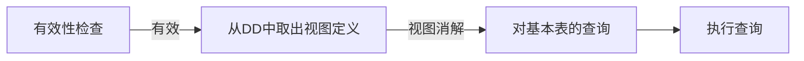

# 三、 sql概述与sql定义语言

## 1、基本概念

**sql的特点：**

- 综合统一：集数据定义、数据操纵、数据控制语言的功能为一体
- 高度非过程化
- 面向集合的操作方式
- 两种使用方式，统一的语法结构
- 简洁易学、通用、功能强

<!-- more -->

**sql语言的分类**：数据定义语言DDL、数据操作语言DML、数据查询语言DQL、数据控制语言DCL

**sql数据库的三级结构：**


子模式对应于视图和部分查询表，模式对应于基本表，内模式对应于存储文件

**sql语句的分类**：模式定义语句、数据操纵语句（增删改查）、事务与控制语句、会话及诊断语句

**sql的数据类型：**


> 在实验中发现，如果要显示001这种类型的数字，可以设置为*sno int(3) zerofill*

## 2、sql的数据定义


> 👉总结：
>
> 创建：create  对象类型 对象名
>
> 删除：drop 对象类型 对象名   [RESTRICT | CASCADE]
>
> RESTRICT：如果有其它对象依赖于该对象，则拒绝进行DROP操作
>
> CASCADE：级联删除该对象及所有依赖于该对象的对象

### 模式

- 模式的定义：

    ```sql
    CREATE SCHEMA <模式名> AUTHORIZATION <用户名>  #若不指定<模式名>，则隐含为<用户名>
    
    #eg
    CREATE SCHEMA library_db AUTHORIZATION Guoqing;
    ```

- 模式的删除

    ```sql
    DROP SCHEMA <模式名> [RESTRICT | CASCADE];
    #RESTRICT – 如果模式内没有对象，则删除该模式
    #CASCADE – 删除模式中所有对象的内容和定义
    
    #eg.
    DROP SCHEMA library RESTRICT;
    ```

### 域

- 定义域：

    ```sql
    CREATE DOMAIN <域名> [AS] <数据类型> [DEFAULT <默认值>] [<域约束>] 
    
    #eg
    CREATE DOMAIN SexType AS CHAR(2) DEFAULT ‘M’ CHECK (VALUE IN (‘M’, ‘F’));
    sex SexType NOT NULL;  #使用域
    ```

- 删除域：

    ```sql
    DROP DOMAIN <域名> [RESTRICT | CASCADE];
    #如果指定RESTRICT，且域用于现有的表中，则删除失败
    #如果指定CASCADE，基于域的任一表中的列都会自动地改变为基本域类型，该域的CHECK约束或默认值都会被列的约束或默认值代替
    
    #eg
    DROP DOMAIN SexType；
    ```

### 表

- 表的建立

    ```sql
    CREATE TABLE [模式名.] <表名> 
    (   
        <列名><数据类型>[NOT NULL│NULL][UNIQUE]
        [, <列名><数据类型>[NOT NULL│NULL][UNIQUE]]…
        [, PRIMARY KEY （<列名>[，<列名>] …）]    #主键,主键属性列用括号括起来
        [, FOREIGN KEY （<列名>[，<列名>] …）REFERENCES  <被参照表名>]#外键
    );
    
    #eg
    CREATE TABLE PropertyForRent 
    (
        propertyNo PNumber NOT NULL,      #数据类型为用户定义的域
        rooms PRooms NOT NULL DEFAULT 4, 
        rent PRent NOT NULL DEFAULT 600, 
        ownerNo OwnerNumber NOT NULL, 
        staffNo StaffNumber Constraint StaffNotHandlingTooMuch ….
        branchNo BranchNumber NOT NULL,
        PRIMARY KEY (propertyNo),   #主键属性和外键属性要用括号括起来
        FOREIGN KEY (staffNo) REFERENCES Staff 
        ON DELETE SET NULL ON UPDATE CASCADE …. #可采取的行为
    );
    ```

- 表的删除

    ```sql
    DROP TABLE <表名> [CASCADE | RESTRICT]
    #既删除DD中表的结构定义，也删除DB中的数据文件
    #RESTRICT：如果有其它对象依赖于该表，则拒绝进行DROP操作
    #CASCADE：级联删除表及所有依赖于该表的对象
    
    #eg
    DROP TABLE PropertyForRent;
    ```

- ==修改表==

    ```sql
    ALETR TABLE <表名>
    [ADD <新列名> <数据类型> {NULL}]     #加新列，新增加的列默认为空值
    [ADD <完整性约束条件>]
    [DROP <完整性约束条件>]   #删除列的完整性约束条件，没有提供删除列的子句
    [MODIFY <列名> <数据类型>]   #修改列，可能破坏已有数据
    
    #eg 增加学生姓名必须取唯一值的约束
    ALTER TABLE student
    ADD CONSTRAINT c1_name UNIQUE (SN)  #c1_name是约束的名字
    
    #eg 删除学生姓名必须取唯一值的约束
    ALTER TABLE S 
    DROP UNIQUE（SN）;  
    #或者 DROP CONSTRAINT c1_name
    ```

### 索引

- 建立索引

    一条语句建立一个索引

    ```sql
    #UNIQUE表示每个索引值只能对应唯一的数据记录，CLUSTER表示聚簇索引，即索引项的顺序与表中记录的物理顺序一致的有序索引，一个基本表最多只能建立一个聚簇索引
    CREATE [UNIQUE] [CLUSTER] INDEX <索引名>  
    ON <表名> (<列名1>[ASC|DESC], <列名2>[ASC|DESC], ...);
    #ASC表示升序，DESC表示降序。默认为升序。
    
    #eg:在SC中按sno升序cno降序建唯一索引
    CREATE UNIQUE INDEX SC_index ON SC( sno ASC，cno DESC);
    ```

- 删除索引

    ```sql
    DROP INDEX [ON <表名>]<索引名>
    
    #eg
    DROP INDEX SC_index;
    ```

## ==3、⚠⚠⚠sql数据查询==

### 一般格式

```sql
SELECT [ALL|DISTINCT] <目标列表达式>[,<目标列表达式>]...      #ALL为默认设置，即不取消重复值，DISTINCT表示取消重复值
FROM <表名或视图名>[,表名或视图名]...     #SELECT子句与FROM子句是必选子句
[WHERE <条件表达式>]
[GROUP BY <列名1>[HAVING<条件表达式>]]
[ORDER BY <列名2>[ASC|DESC]];     #其中，列名2也可以用SELECT子句中相应列的序号
```

**含义：**


**概念性的执行步骤：**

- 计算出现在FROM后面的表之间的笛卡儿积
- 实施由WHERE后面的条件规定的选择操作
- 根据GROUP BY后面的属性的值进行分组
- 对于分组出来的每一个小组，实施由HAVING后面的条件规定的选择操作，保留满足条件的小组
- 将出现在SELECT后面的属性投影成结果表
- 将结果表中的元组根据ORDER BY后面的属性及指定的顺序（升序或降序）输出

### SELECT子句：

*SELECT [ALL|DISTINCT] <目标列表达式>[,<目标列表达式>]...*

- *代表指定表的所有列，一般用在exists和not exists里面

- ALL为默认设置 ，即不取消重复值，DISTINCT表示取消重复值

- ==聚集函数（只能用于SELECT子句和HAVING子句中 ）==

    

    

    > 当这些函数遇到空值时，除COUNT(*)外，都跳过空值而只处理非空值。

    例子：

    

- ==算术表达式：==  

    +、-、*、/、%、INTEGER（取整）、SQRT（求平方根）、三角函数（SIN、COS）、字符串函数SUBSTRING（取子串）、UPPER（大写字符）、MONTHS_BETWEEN（月份差）

    ---

- 用AS子句为列命名 

    ```sql
    SELECT staffNo, fName, lName, salary/12 AS monthlySalary FROM Staff;
    ```

### FROM子句：

可以给表指定别名：多个表放在FROM子句中，代表多表进行笛卡尔积


### WHERE子句：

WHERE子句的查询条件可以用多种形式表示： 


- 比较运算作为查找条件 (>,  <,  >=,  <=,  =,  <>(不等于))

    ```sql
    WHERE salary > 10000
    ```

- 复合比较运算作为查找条件 (AND, OR, NOT ) 

    ```sql
    WHERE city = ‘London’ OR city = ‘Glasgow’
    ```

- 范围作为查找条件（BETWEEN / NOT BETWEEN）。==BETWEEN包含端点==

    ```sql
    WHERE grade BETWEEN 85 AND 95
    ```

- 集合成员测试作为查找条件（IN / NOT IN）

    ```sql
    WHERE place IN('湖南','湖北')
    ```

- 模式匹配作为查找条件（LIKE / NOT LIKE）

    SQL中的两种特殊的模式匹配符号：

    - %: 百分号表示零或多个字符序列（通配符）

    - _: 下划线表示任意单个字符

        

    ```sql
    WHERE sname LIKE '刘%' OR SNAME LIKE '__晓%'   #一个汉字占两个字符位
    ```

- 空查找条件（IS NULL  /  IS NOT NULL）

    ```sql
    WHERE propertyNo = ‘PG4’ AND comment IS NULL
    ```

### GROUP BY子句 ：

将查询结果按指定列名的取值分组，并选取满足HAVING中的内部函数表达式所指定条件的组。目的：细化聚集函数的作用对象。 ==HAVING子句是包含在GROUP BY子句中的== 

> WHERE子句是在表中选择满足条件的元组，而HAVING子句是在各组中选择满足条件的小组

> ISO标准规定，应用GROUP BY时，两个空值被认为是相等的

> ==当使用GROUP BY时， SELECT列表中的项必须每组都有单一值(因为最终一个组会变成一个元组)== 

> 当使用GROUP BY时， SELECT子句中除集合函数外，其它所有列必须在GROUP BY子句中出现；反之，GROUP BY子句出现的列不一定出现在SELECT列表中；
>
> HAVING子句使用的列名必须出现在GROUP BY 子句列表中，或者包括在集合函数中。实践中，HAVING子句的条件表达式至少包括一个集合函数

### ORDER BY子句

order by子句必须放最后用于对最终的查询结果进行排序，<u>不能用在子查询中</u>

该子句后可以跟多个排序的变量名，第一个变量为主序，下面依次类推。==ASC（升序）为默认设置== 。它也可以用SELECT子句中相应列的序号。


### 简单查询

单表查询

- 查询指定的列：通过在SELECT子句的<目标列表达式>中指定要查询的列来实现。可以使用*、聚集函数、算术表达式等
- 查询表中行：通过WHERE子句的查询条件来实现

### 复杂查询

#### 连接查询：

```sql
SELECT student.sno, sname, cno, grade FROM student, s_c WHERE student.sno = s_c.sno;
```

==注意在多表查询中，当两个列名相同时，需采用表名.列名以示区别==

#### 嵌套查询（子查询）：

子查询可以被使用在外部SELECT语句的WHERE子句、HAVING子句甚至SELECT子句中

==子查询应遵循如下规则：== 

- ORDER BY子句不能用于子查询（因为ORDER BY子句是对最终显示的结果进行排序）

- 子查询总是**括在圆括号** 中，作为表达式的一部分出现在条件比较运算符的右边，并且可以有选择的跟在IN，SOME（ANY），ALL和EXIST等谓词后面。

- 子查询select列表必须由**单个列名或表达式** （如集合函数）组成，除非子查询使用了关键字EXISTS（多列多行时使用）

- 默认情况下，子查询中列名取自子查询的FROM子句中给定的表，也可以通过限定列名的办法指定取自外查询的FROM子句中的表（不相关子查询和相关子查询）

- 带有比较运算符的子查询（==此时子查询返回单个值==，可以使用集合函数 ）

    ```sql
    #列出个人工资高于平均工资的所有职员，并求出多于平均数的值。
    SELECT staffNo, fName, lName, position, salary–(SELECT AVG(salary) FROM Staff) AS SalDiff
    FROM Staff
    WHERE salary > (SELECT AVG(salary) FROM Staff);
    ```

- 带有IN谓词的子查询（子查询返回单个值或单个列多个行）

    ```sql
    #查询选修了课程“C2”的学生的学号和姓名
    SELECT sno, sname FROM S WHERE sno IN ( SELECT sno FROM SC WHERE cno = ‘C2’ );
    ```

- 多层嵌套：子查询中又嵌套子查询

- ==不相关子查询和相关子查询== 

    - 不相关子查询：内层的子查询完全独立于外层的SELECT语句。==m + n== （只执行了一次子查询，在检查外层的元组时，无需再执行子查询）

        > 执行过程：1）执行子查询，其结果不被显示，而是传递给外部查询，作为外部查询的条件使用。2）执行外部查询，并显示整个结果。

    - 相关子查询：子查询的判断条件涉及外层父查询的属性。要用到存在谓词EXISTS和NOT EXISTS，或者ALL、SOME等。==m * n== （每检查一个元组，都要执行一次子查询）

        > 执行过程：1）从外层查询中取出一个元组，将元组相关列（被内层子查询引用）的值传给内层查询。2）执行内层查询，得到子查询操作的值。3）外查询根据子查询返回的结果或结果集得到满足条件的行。4）然后外层查询取出下一个元组重复做步骤1-3，直到外层的元组全部处理完毕。

        ```sql
        #找出每个学生超过他自己已选修课程平均成绩的课程号
        SELECT sno, cno FROM SC x WHERE G>= (SELECT AVG(G) FROM SC y WHERE x.sno = y.sno);
        ```

- 量化比较谓词

    - 作用：产生单个列的子查询

    - 通用形式：`expr Θ { SOME | ANY | ALL } (Subquery)其中Θ∈{<,<=,=,<>,>,>=} `。expr为表达式。该形式中的SOME与ANY含义相同，但用SOME而不用ANY。SOME某些，ALL全部。

        ```sql
        #查询其它系中比信息系某一学生年龄小的学生姓名和年龄
        SELECT SN, SA FROM S WHERE SA < SOME (SELECT SA FROM S WHERE SD =‘IS’) AND SD <>‘IS’;
        ```

    > expr Θ （子查询）  子查询返回单个值
    >
    > expr IN （子查询）
    >
    > expr Θ { SOME | ANY | ALL } (子查询)，>= ALL可以用于求最大值

- ==EXISTS谓词== 

    - 通用形式：[NOT] EXISTS （Subquery）

    - 作用：测试被子查询检索到的行集(子查询可以返回多行多列)**是否为空** 。谓词 EXISTS （Subquery）为真当且仅当子查询返回一个非空的集合。NOT_EXISTS则相反

    - NOT EXISTS谓词可以实现**关系代数的差运算**

        ```sql
        #查询没有选修‘C1’号课程的学生的姓名。
        SELECT sname FROM S WHERE NOT EXISTS (SELECT * FROM SC WHERE sno = S.sno AND cno = ‘C1’);
        ```

    - 所有带IN谓词、比较运算符、SOME和ALL谓词的子查询都可以用带EXISTS谓词的子查询等价替换，反过来就不一定

    - 可以采用双嵌套NOT_EXISTS来实现**带全称量词的查询**。

        ```sql
        #查询选修了全部课程的学生姓名
        #转化为查询这样的学生x，没有一门课程y 是x不选修的
        SELECT SN
        FROM S     #查询学生x
        WHERE NOT EXISTS  #不存在课程y
            （SELECT ﹡
            FROM C
            WHERE NOT EXISTS  #x不选修课程y
                （SELECT ﹡
                FROM SC
                WHERE S# = S.S#
                AND C# = C.C#））
        ```

    - 可以采用NOT EXISTS谓词实现**关系代数的除运算**

        ```sql
        #查询至少选修了学生‘95002’选修的全部课程的学生号码
        #转换为查询学号为x的学生，不存在这样的课程y，学生95002选修了y，而学生x没有选
        SELECT S#
        FROM S          #查询学生x
        WHERE NOT EXISTS
            （SELECT ﹡
            FROM C       #不存在课程y
            WHERE EXISTS   #95002选修了课程y
                (SELECT ﹡
                FROM SC SCX
                WHERE SCX.C# = C.C# AND SCX.S#=‘95002’）
            AND NOT EXISTS   #x没有选修y
                (SELECT *
                FROM SC SCY
                WHERE SCY.C# = C.C# AND SCY.S#=S.S#)
            );
            
        SELECT DISTINCT S#    #因为是从SC里选的学号，故需要DISTINCT
        FROM SC SCX         #查询学生x
        WHERE NOT EXISTS
            （SELECT ﹡
            FROM SC SCY    #不存在课程y
            WHERE SCY.S# = ‘95002’  #95002选修了课程y
            AND NOT EXISTS    #x没有选修y
                （SELECT ﹡  
                FROM SC SCZ
                WHERE SCZ.S# = SCX.S#
                AND SCZ.C# = SCY.C#））；
        ```


## 4、数据更新

### 插入数据：INSERT （元组级）

==插入数据时，表定义中说明了NOT NULL的列不能取空值== 

- 用**子句**向表中插入数据：将新元组插入表中

    ```sql
    INSERT 
    INTO <表名> [(<列名1>[, <列名2>]...)] 
    VALUES(<常量1>[, <常量2>]...)  
     #未指定任何列名时，新插入的属性必须在每个属性列上均有值，仅指定部分列名时，新元组的其他列为空值
     
    #eg 插入一条选课记录（‘95020’，‘C1’）
    INSERT INTO SC（S#, C#）VALUES （‘95020’, ‘C1’）; 
    ```

- 用**子查询**向表中插入数据

    ```sql
    INSERT 
    INTO <表名> [(<列名1>[, <列名2>]...)] 
    SELECT语句;  #SELECT语句的返回列要和INFO里的对应
    
    #eg  对每个系，求学生的平均年龄，并把结果存入数据库
    INSERT INTO Deptage (SD, Avgage) SELECT SD, AVG(SA) FROM S GROUP BY SD;
    ```

### 修改数据：UPDATE

一条UPDATE语句在某一时刻只能更新**一张表**，但可以更新一张表中的**多列**，也可以更新**多行**数据。

- 用**子句**修改表中数据

    修改表中满足WHERE条件的元组：

    ```sql
    UPDATE <表名>
    SET <列名> = <表达式>[, <列名> = <表达式>] #用表达式的值取代相应的属性列值
    [WHERE <条件表达式>]				#省略WHERE语句则修改全部元组
    
    #eg 将学生95001的年龄改为22岁
    UPDATE S SET SA = 22 WHERE S# = ‘95001’;
    
    #eg 将所有学生的年龄增加1岁
    UPDATE S SET SA = SA + 1；
    ```

- 用**子查询**修改表中数据：子查询可以嵌套在WHERE语句的条件表达式中，用于构造修改的条件。相关子查询

    ```sql
    #将计算机科学系全体学生的成绩置零
    #相关子查询，每次拿出SC中的一个元组，得到它的系，如果为CS则将成绩置0
    UPDATE SC SET G = 0 WHERE ‘CS’ = ( SELECT SD FROM S WHERE S.S# = SC.S#);
    ```

### 删除数据：DELETE （元组级）

DELETE用于**从指定表中删除满足条件的元组**，但不能用来从特定的列中删除数据。一条DELETE语句可以从表中删除一个或多个元组。

- 用**子句**删除表中数据

    删除表中满足WHERE条件的元组：

    ```sql
    DELETE 
    FROM <表名>
    [WHERE <条件表达式>]  
    
    #eg 删除学号为95001的学生记录
    DELETE FROM S WHERE S# = ‘95001’;
    ```

    > 省略WHERE语句则删除全部元组，但**只删除了表中的数据**，而不是表的定义，表的定义仍在DD中。**删除表应当用DROP**

- **子查询**可以嵌套在WHERE语句的条件表达式中。相关子查询

    ```sql
    #删除计算机科学系全体学生的选课记录
    #相关子查询
    DELETE FROM SC WHERE ‘CS’ = ( SELECT SD FROM S WHERE S.S# = SC.S#);
    ```


## 5、视图

- **概念：**
    - 视图是==动态结果==：对一个或多个基本关系进行关系操作得到的动态结果，是从一个或几个基本表（或视图）导出的表。而且对基本表的操作将在视图可见的范围内映射到视图上。==视图对应的内容是实时的、最新的内容== 
    - 视图是==虚关系==：它不包含真正存储的数据，其内容不占用存储空间。
    - **视图的内容被定义成基于一个或多个基本关系的查询**
    - 视图是在==外模式==这一层，为用户所用
- **操作：**视图可以和基本表一样被查询、被删除。也可以在一个视图之上再定义新的视图，但==对视图的更新（增、删、改）操作则有一定的限制==。==对视图的一切操作最终也要转换为对基本表的操作。==

### 视图的创建及种类

- 视图可以从一张表、几张表或其他视图中创建。 

    ```sql
    CREATE VIEW <视图名> [(<列名1>[,<列名2>]...)]
    AS 
    SELECT 语句
    [WITH CHECK OPTION]  
    ```

    > **几点说明：**
    >
    > - ==创建视图只是将视图的定义存入DD（数据字典），并不会真的执行SELECT语句，当对视图查询时，才根据视图的定义从基本表中将数据查出。==
    >
    > - **省略视图名后的列名表时**，默认该视图由子查询中SELECT子句目标列中的诸属性列组成
    > - 若使用==WITH CHECK OPTION==，则对视图进行UPDATE和INSERT操作时，保证更新行满足视图定义中的WHERE子句指定的条件，否则将被DBMS拒绝
    > - 当目标列不是单一的属性列(如集合函数)、存在同名列以及需启用更合适的名字时，需要指定组成视图的所有列名
    > - 可以在视图中增加虚拟列（派生列），即基本表中并不存在的列，如avg(grade)

- **视图的种类**

    - 水平视图：从单个基本表导出，并且只是**去掉了**基本表的**某些行**

        ```sql
        #创建一个视图，让分支机构B003的经理只看到他所在分支机构的职员的信息
        CREATE VIEW Manager3Staff
        AS SELECT *
        FROM Staff
        WHERE branchNo = ‘B003’;
        ```

    - 垂直视图：从单个基本表导出，并且只是**去掉了**基本表的**某些列** 

        ```sql
        #建立关于分支机构B003职员信息但不包括工资信息的视图
        CREATE VIEW Staff3
        AS SELECT staffNo, fName, lName, position, sex
        FROM Manager3Staff;		#视图可以从其他视图中创建
        ```

    - 分组视图：用**GROUP BY 子句**定义的视图

    - 连接视图：用**连接运算**得到的视图

        

### 删除视图

- ```sql
    DROP VIEW <视图名>{CASCADE|RESTRICT} 
    ```

- 视图是虚表，**删除的是DD中的视图的定义**，**对产生视图数据的基本表中的数据没有影响**

- 默认RESTRICT ，如果存在依赖被删除视图的其他对象，则不允许删除

    如果指定CASCADE**，**删除视图可能产生级联删除

### 查询视图

- **步骤**



- ==视图消解==：将对视图的查询**转换为对基本表的查询**。执行对视图的查询时，从数据字典中取出视图的定义，将定义中的子查询和用户的查询结合起来，转换成等价的对基本表的查询的过程

    > 简单转换的过程：
    >
    > - 将SELECT列表中给出的列名转换为视图定义中对应的列名
    >
    > - FROM子句的视图名可以视图定义中的FROM列表代替
    >
    > - 用AND将WHERE子句和视图定义中的WHERE子句合并
    >
    > - 从视图定义中复制GROUP BY和HAVING子句
    >
    > - 将 ORDER BY列名转换为视图定义中对应的列名
    >
    >     例子：
    >
    >     
    >
    >     
    >
    >     

> 复杂转换：涉及集合函数，考虑HAVING子句等等
>
> 

- **查询视图的约束：**

    - 如果视图中某个列是基于集合函数的，那么，该列只能出现在访问视图的SELECT和ORDER BY子句中，特别是，该列不能出现在WHERE子句中，并且不能作为集合函数的参数

        ```sql
        SELECT * FROM StaffPropCnt WHERE cnt > 2; //错误
        SELECT COUNT (cnt) FROM StaffPropCnt;  //错误
        ```

    - 分组视图不能与基本表或视图进行连接操作

### 更新视图

- 👉**对视图的更新最终要转换为对表的更新**，但有些更新不能有意义地转换成对基本表S的更新，如修改一个集合函数得到的列，因此==对视图的更新操作有一定的限制==
- 在视图定义时加上WITH CHECK OPTION子句可以使得对视图进行更新操作时需满足视图定义中子查询的条件
- ==视图可更新的充要条件==
    - 没有指定DISTINCT,即重复元组未从查询结果中消除；
    - 定义查询的SELECT列表中的每个元素均为列名（而不是常量，表达式或聚合函数），且列名不能出现多于一次；
    - FROM子句只能指定一个表，即视图必须有一个源表且用户有请求该表的权限。如果源表本身就是一个视图，那么视图必须满足这些条件。因此，排除了基于连接、并（UNION）、交（INTERSECT）或差（EXCEPT）操作的所有视图；
    - WHERE子句不能包括任何引用了FROM子句中的表的嵌套SELECT操作，即不能出现相关子查询
    - 定义查询不能有GROUP BY或HAVING子句。
    - 添加到视图中的每一行都不能违反基本表的完整性约束
- 分类
    - 可更新视图：满足上面的六个条件，即对视图的更新能唯一的有意义的转换为对基本表的更新
    - （理论上）不可更新的视图
    - 不允许更新的视图`(*>﹏<*)′

### 视图的优缺点

- **优点：**①提高逻辑独立性、②实时性、③提高安全性、④简化结构及复杂操作、⑤多角度地、更灵活地共享、⑥数据完整性

- **缺点：**①更新的局限性、②结构的局限性、③性能开销（查询时需要转化）

    > **视图维护：**更新基本表引起视图更新的过程称为视图维护
    >
    > **视图物化：**把第一次访问视图的结果存储为数据库的临时表；这样，基于物化视图的查询比每次重新计算视图要快的多。但会带来视图维护的代价

## ==6、sql的完整性约束==

### **基本概念：**

- **完整性：**指数据库中数据的正确性、有效性和相容性（表示同一对象的两个或多个数据必须一致）
- **完整性约束**：数据库中数据应满足的条件

### 非过程性完整性约束

- **数据取值要求：**非空约束（NOT NULL）、唯一性约束（UNIQUE）、CHECK约束（CHECK(searchcondition)）

    > CHECK子句只对定义它的关系起约束作用，对其他关系没有任何作用

    ```sql
    sex CHAR NOT NULL CHECK (sex IN (‘M’, ‘F’))
    ```

    ```sql
    #eg 增加学生姓名必须取唯一值的约束
    ALTER TABLE student
    ADD CONSTRAINT c1_name UNIQUE (SN)  #c1_name是约束的名字
    
    #eg 删除学生姓名必须取唯一值的约束
    ALTER TABLE S 
    DROP UNIQUE（SN）;  
    #或者 DROP CONSTRAINT c1_name
    ```

- **域约束：**通过自定义域来实现

    ```sql
    CREATE DOMAIN DomainName [AS] dataType
    [DEFAULT defaultOption]
    [CHECK (searchCondition)]  #searchCondition 可以用SELECT语句表达
    
    #eg
    CREATE DOMAIN SexType AS CHAR(2)
    DEFAULT ‘M’
    CHECK (VALUE IN (‘M’, ‘F’));
    
    #使用域来定义列
    sex SexType NOT NULL;
    ```

- **实体完整性：**主键属性不空。DBMS自动支持实体完整性（拒绝破坏实体完整性的操作（不合法的插入和更新））

    ```sql
    PRIMARY KEY(<列名表>)  #主键定义   
    UNIQUE(<列名表>)   #候选键定义
    ```

- **参照完整性**：DBMS自动支持参照完整性（拒绝破坏参照完整性的操作，如不合法的对子表（参照表）的插入和更新操作，不合法的对父表（被参照表）的删除和更新操作）。注意SQL语句的顺序。

    ```sql
    FOREIGN KEY （<列名>[，<列名>] …）REFERENCES <被参照表名> 
    [ON DELETE [CASCADE | SET DEFAULT | SET NULL | NO ACTION] ]
    [ON UPDATE [CASCADE | SET DEFAULT | SET NULL |NO ACTION] ]
    ```

    > 参照完整性被破坏时可选择的策略：
    >
    > 

- **一般约束（企业约束）**

    在创建和修改表时使用CHECK/UNIQUE，还可以==CREATE ASSERTION（设置断言）==

    当完整性约束涉及多个关系或者与聚合操作有关，则可以采用SQL的断言机制来完成

    ```sql
    CREATE ASSERTION AssertionName
    CHECK (searchCondition)
    
    #限制staff不能管理太多的房产
    CREATE ASSERTION StaffNotHandlingTooMuch
    CHECK (NOT EXISTS 
               (SELECT *
                FROM PropertyForRent
                GROUP BY staffNo
                HAVING COUNT(*) > 100));
    ```


### 过程性完整性约束：触发器

- 概念：一类靠事件驱动的特殊过程，一旦由某个用户定义，任何触发该触发器的事件发生时，均由**服务器**自动激活相应的触发器。

- 三要素：触发事件（包括Insert、delete、update等）、触发条件、触发动作

- 作用：示警（给出提示信息）；满足特定条件时自动执行某项任务以消除负面影响

- 定义(Full SQL-99的Create Trigger语法)

    ```sql
    CREATE TRIGGER trigger_name 
    {BEFORE | AFTER} {INSERT | DELETE | UPDATE [OF columnname{,columnname…}]} ON tablename #触发事件[REFERENCING corr_name_def {, corr_name_def…}]  #旧值或新值名表
    [FOR EACH ROW | FOR EACH STATEMENT]  
    [WHEN (search_condition)]   #触发条件
    {	
    	statement |          #触发动作，为单个或一系列SQL语句
    	BEGIN ATOMIC statement; 
    	{statement; …} 
    	END
    } ;
    
    #eg 设计一个用于s_c的触发器，该触发器规定，如果需要修改成绩，则需要保证修改之后的成绩不得低于之前的成绩，否则拒绝修改
    CREATE TRIGGER trig_grade
    AFTER UPDATE OF grade ON s_c
    REFERENCING OLD AS oldg, NEW AS newg
    FOR EACH ROW
    WHEN (oldg.grade > newg.grade)
    	UPDATE s_c
    	SET GRADE = oldg.grade
    	WHERE cno = oldg.cno AND sno = oldg.sno;  #根据主键找到该元组
    ```

    > 几点说明：
    >
    > - 触发器名是一个标识符，在其所属的模式里是唯一的
    >
    > - ON<表名>子句里的表必须和触发器位于同一个模式中
    >
    > - 定义行的相关名字的corr_name_def 如下:
    >
    >     {OLD [ROW] [AS] old_row_corr_name
    >
    >     | NEW [ROW] [AS] new_row_corr_name
    >
    >     | OLD TABLE [AS] old_table_corr_name
    >
    >     | NEW TABLE [AS] new_table_corr_name}
    >
    > - 如果在触发器定义中省略WHEN子句，即省略触发条件，则触发动作在触发器被激活后立即发生
    >
    > - 触发动作可以是单个或一系列SQL语句，若为一系列，需要使用BEGIN ATOMIC...END子句，语句之间用分号隔开
    >
    > - 注意触发器级联问题，防止一个触发动作引发一系列连锁反应（一个触发器的动作引发另一个触发器的动作）以致失控

### 两种完整性约束的对比

- 非过程性完整性约束：种类和能力有限但易于理解；直接为系统所知；难以给出约束不满足时的相应动作

- 过程性完整性约束：给出了约束不满足时的相应动作；保证事物的一致性
