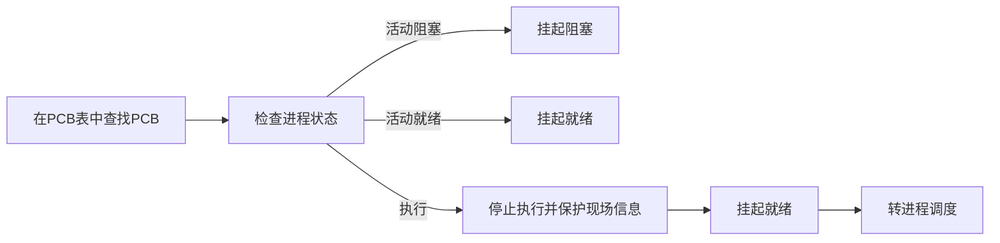
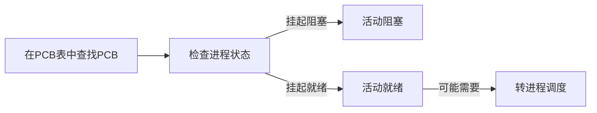

# 二、进程与线程

## ==重点：==

进程定义，进程控制块（PCB），进程的状态及其变化，进程切换与CPU模式切换，进程调度，上下文切换，

进程队列，进程家族树和进程创建

进程通信机制（共享内存，消息传递） ， 信号与中断的区别。  通信中的同步问题：阻塞/非阻塞

线程，线程和进程的区别，引入线程的好处，多线程模型

## 1、进程的定义、特征、描述和组织


**概念：** 进程是一个可并发执行的具有独立功能的，是程序关于某个数据集合的一次执行过程，也是操作系统进行资源分配和保护的基本单位 。

从理论角度看，进程是对正在运行的程序过程的抽象；从实现角度看，进程是一种数据结构。

进程与程序的关系：m对n

|                  | 进程                | 程序（本质就是文本段、代码段） |
| ---------------- | ------------------- | ------------------------------ |
| **状态**         | 动态                | 静态                           |
| **能否长久保存** | 暂时                | 永久                           |
| **组成**         | 代码段、数据段、PCB | 代码段                         |
| **能否“再生”**   | 进程可以创建新进程  | 程序不能形成新程序             |


**特征：** 

- **动态性**：进程是程序的一次执行过程，是动态地产生、变化和消亡的

- 并发性：内存中有多个进程实体，各进程可并发执行

- 独立性：进程是能独立运行、独立获得资源、独立接受调度的基本单位

- 异步性：进程以各自独立的不可预知的速度向前推进，操作系统要提供“进程同步机制”来解决异步问题

- 结构性：**进程实体由程序段、数据段及进程控制块（PCB）组成**，又称为进程映像

- 共享性

      

**进程的描述** 

- ==进程实体（进程映像）== ：某时刻进程的内容及其状态的集合

    组成：

    - 控制块（PCB）：每个进程捆绑一个控制块，用于存储进程的标识信息、现场信息、控制信息
    - 程序块
    - 数据块
    - 核心栈：每个进程捆绑一个核心栈，用于保存进程在核心态工作时的现场保护

- ==进程的上下文== ：操作系统把进程物理实体和支持进程运行的环境合称为进程上下文

    

    > 所谓的“进程上下文”，就是一个进程在执行的时候，CPU的所有寄存器中的值、进程的状态以及堆栈上的内容，当内核需要切换到另一个进程时，它需要保存当前进程的所有状态，即保存当前进程的进程上下文，以便再次执行该进程时，能够恢复切换时的状态，继续执行。

==进程控制块（PCB）：== 是描述和管理进程的数据结构。它是进程实体的一部分。PCB是进程存在的唯一标志。由OS创建和管理。

组成：

- 进程标识信息：包括进程标识符、家族关系、用户标识符（进程的拥有者）
- 进程现场信息：进程在运行时存放在处理器中的各种信息
- 进程控制信息：包括进程当前状态、进程队列指针、进程优先级、通信信息、程序和数据地址、资源清单

常用组织方式：

- 线性方式：PCB顺序存放在一片连续内存中

- 链表方式：将同一状态的PCB组成一个链表，如就绪队列

    

- 索引方式：将同一状态的PCB归入一个索引表，再由索引指向相应的PCB

    


## 2、进程的状态与转换


- **三种基本状态**

    

    M个处理器，N个进程：

    ①M>=N：运行态：0 \~ N，**就绪态：0**（有空闲处理器，无就绪进程），阻塞态：0\~N

    ②M<N：运行态：0 \~ M，就绪态：0 \~ N-M，阻塞态：0~N

- **另外两种状态：**

    

- **状态之间的转换**

    

> **挂起状态：**把某些进程挂起（suspend），==对换到磁盘镜像区中== ，暂时不参与进程调度， 起到减轻系统负荷或者进行检查和改正的目的。
>
> 原因：
>
> - 系统中的进程均处于等待状态，需要把一些阻塞进程对换出去，腾出内存给就绪进程运行
>
> - 进程竞争资源，系统负荷过重，需挂起部分进程以调整系统负荷
>
> - 将定期执行的进程对换出去以减轻系统负荷
>
> - 用户要求挂起自己的进程，以进行检查和改正
>
> - 父进程要求挂起后代进程，以进行检查和改正
>
> - 操作系统需要挂起某些进程，以进行检查和改正
>
> 
>
> **七态模型：**
>
> 
>
> 

## 3、进程控制


**进程控制：**对系统中的所有进程实施有效的管理，即实现进程状态转换


**原语的概念：**由若干机器指令构成的，用以完成特定功能的一段程序，这段程序在执行期间不允许中断，只能一气呵成。


进程控制相关的原语要做的事情：

- 更新PCB中的信息（如修改进程状态标志、将运行环境保存到PCB、从PCB恢复运行环境）

- 将PCB插入合适的队列

- 分配/回收资源

      

**进程的创建和终止：**


> **僵尸进程：** 子进程已终止，但父进程尚未调用wait()
>
> **孤儿进程 ：**子进程还在执行的时候父进程已终止。Linux和UNIX会将init进程作为孤儿进程的父进程。

**进程的阻塞和唤醒**


> 阻塞是主动过程（进程自己调用阻塞原语），唤醒是被动过程（另一个发现者进程（合作的并发进程）调用唤醒原语）

**进程的挂起与激活：**

挂起原语的功能 ：将指定进程挂起😶

过程：




激活原语的功能：将指定进程激活😶

过程：



**进程的调度和切换**


**调度和切换的时机问题**：调度和切换并不一定能一气呵成。通常的做法是，由内核置请求调度标志，延迟到敏感性操作完成后再进行进程调度和进程上下文切换。


**CPU模式切换：**

处理器总处于以下状态中的一种：

- 内核态，运行于进程上下文，内核代表进程运行于内核空间，使用核心栈。 (进程请求系统调用，陷入内核)
- 内核态，运行于中断上下文，内核代表硬件运行于内核空间，与任何进程无关，中断服务程序正在处理特定中断。 (进程被中断)
- 用户态，运行于进程上下文，用户进程在运行，使用用户栈。 （进程正常运行)

内核可以处于两种上下文：进程上下文和中断上下文。

- 在系统调用之后，用户应用程序进入内核空间，此后内核空间针对用户空间相应进程的代表就运行于进程上下文。
- 异步发生的中断会引发中断处理程序被调用，中断处理程序就运行于中断上下文。
- 中断上下文和进程上下文不可能同时发生。
- 运行于进程上下文的内核代码是可抢占的，但中断上下文则会一直运行至结束，不会被抢占。


## 5、进程通信


**概念：**进程之间的信息交换。为了保证安全，一个进程不能直接访问另一个进程的地址空间

**方法：**共享内存、消息传递、信号机制、管道、RPC、Socket等等。其中共享内存和消息传递是IPC的两种**基本模型**。

共享内存：快。仅在建立共享内存区域时才采用系统调用。

消息传递：适合交换少量数据、易实现。常采用系统调用。

==共享内存：==


==消息传递==


> **同步或异步的通信**
>
> 同步（阻塞）：发送之后需等待被接收；接收进程需等待有消息可用
>
> 异步（非阻塞） ：发送之后可继续其他操作；接收进程收到有效消息或者空消息，继续其他操作
>
> 有效的组合：阻塞发送，阻塞接收；非阻塞发送，阻塞接收（如客户机-服务器）；非阻塞发送，非阻塞接收。==没有阻塞发送，非阻塞接收，否则发送进程可能死等。==

==信号机制：==

**概念：**软件中断通知事件机制，一种古老且简单的通信机制。通过发送一个**指定信号**来通知进程某个异常事件发生。每个信号都有一个名字和编号，这些名字都以“SIG”开头，如SIGKILL。

**信号与中断的相同点及区别**

相同点：采用异步通信方式；获得请求时，暂停正在执行的任务转而执行相应的处理程序，处理完毕后返回断点；都可以被屏蔽。

区别：

|          | 实现           | 优先级 | 运行态 | 及时           | 其他                     |
| -------- | -------------- | ------ | ------ | -------------- | ------------------------ |
| **中断** | 硬件、软件结合 | 有     | 核心态 | 及时           | 程序并不知道自己被中断。 |
| **信号** | 软件           | 无     | 用户态 | 有较大时间延迟 | 由程序接收               |


==管道机制==

**管道的概念**：连接读写进程的一个特殊文件。==本质：共享文件==，可借助文件系统的机制实现。用于同一机器的进程间通信


**管道的分类：**匿名管道（半双工、只能用于具有亲缘关系的进程间通信）、有名管道（克服了只能用于具有亲缘关系的进程之间通信的限制）


## 6、线程概念、多线程模型


**引入线程的目的**

- 在操作系统中引入进程的目的是使多道程序能并发执行，以改善资源利用率及提高系统吞吐量；

- 在操作系统中再引入线程，则是为了减少程序并发执行所付出的时空开销，使操作系统具有更好的**并发性**。

**概念**：

- 线程是进程内一个相对独立的、可调度的执行单元。

- 线程是CPU调度的基本单位

- 它由线程ID、程序计数器、寄存器集合和栈组成。 

- ==它与属于同一进程的其他线程共享代码段、数据段和其他操作系统资源。== 

- 线程自己基本上不拥有资源，只拥有一点在运行时必不可少的资源（如程序计数器、一组寄存器和栈），但它可以与同属一个进程的其他线程共享进程拥有的全部资源


**线程与进程的比较：**

> 线程可以主动让出处理器，进程可以通过wait()来让出处理器

|          | 调度                                       | 拥有的资源                                                   | 系统开销 |
| -------- | ------------------------------------------ | ------------------------------------------------------------ | -------- |
| **进程** | 在传统OS中，进程是调度和分配资源的基本单位 | 进程是拥有资源的基本单位，由一个或多个线程及相关资源构成     | 大       |
| **线程** | 引入线程后，线程是调度和分派的基本单位     | 基本上不拥有资源，只拥有一点在运行时必不可少的资源（如程序计数器、一组寄存器和栈），但它可以与同属一个进程的其他线程共享进程拥有的全部资源 | 小       |


**属性**


**实现方式**

- 用户级线程

    - 概念：不依赖于操作系统核心，由应用进程利用**用户级线程库**提供创建、同步、调度和管理线程的函数来控制的线程。

    - **用户级线程对OS不可见，OS调度的依然是内核级线程**

    - 纯用户级线程之间不能抢占，除非主动放弃处理器

    - 优势：速度快（因为它不需要内核干预）

    - 限制：

        - 当一个线程阻塞时，整个进程都必须等待（因为用户级线程对OS不可见）
        - 处理机时间分配对象是进程，每个用户级线程的执行时间相对少一些

- 内核级线程

    - 概念：依赖于内核，由**操作系统内核** 完成创建和撤消工作的线程。 
    - 一个内核级线程阻塞时不会影响同一进程的其他线程的运行。（因为可以调度其他线程）
    - 处理机时间分配对象是线程，所以有多个线程的进程将获得更多处理机时间。

    - 缺点：系统开销

    

    

    

- **多线程模型**

    

    

    

    

## ==7、可能的大题：代码？==😫

### 1、fork()、exec()、vfork()、clone()

**fork():**  创造的子进程是父进程的完整副本，复制了父亲进程的所有资源

**exec():**   fork()函数会调用此系统调用，使用指定的新程序填充进程空间

**vfork()**：创建的子进程与父进程共享数据段,而且由vfork()创建的子进程将先于父进程运行

**clone()：**允许子进程有选择的共享父进程资源

例子：

```c
void main( ) { 
    pid_t pid;
    pid = fork();
    if (pid < 0){
        printf(“fork new process error!\n”);
        exit(-1); 
    }
    else if (pid ==0){		//child process
        execlp(“/bin/ls”,”ls”, NULL);
        printf("LINE J");	//只有excelp调用失败时才会执行这条语句
    } 
    else{
        wait(NULL);
        printf(“Child Complete”);
        exit(0);
    }
}
```

### ==***2、fork()、getpid()和printf()==

==进程家族树：==


----------------------------------------


# 
