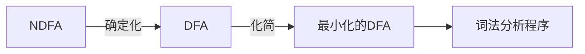

# 第一章 引论 

## ==1、编译和解释==

- ==编译方式的特点：== 
    - 源程序的执行需要分阶段（目标程序是机器语言：编译、运行，目标程序是汇编语言：编译、汇编、运行）；  
    - 生成了目标代码，且可多次执行
    - *编译程序与具体的机器和语言有关* 
- ==解释方式的特点：==
    - 更灵活、交互方便，节省空间
    - 效率低
- ==根本区别：== 在解释方式下，并不生成目标代码，而是直接执行源程序本身。
- ==相同点：== 都需要进行词法、语法、语义分析


## 2、编译程序的工作过程（词法分析、语法分析等）

- 

- ==词法分析== （或扫描）

    - 词法分析器读入组成源程序的字符流，并将它们组织成有意义的词素的序列。对于每个词素，产生**词法单元** 作为输出
    - *词法单元：<token-name, attribute-value>*，前者为抽象符号，后者为条目。eg.(id, 1)。分隔词素的空格会被词法分析器忽略掉。词法单元的名字常被称为终结符号，属性值是一个指向符号表的指针，符号表中包含了该词法单元的附加信息。

- ==语法分析== （或解析）

    - 语法分析器使用由词法分析器生成的各个词法单元的第一个分量来创建语法树（内部节点：运算，子节点：该运算的分量）

- ==语义分析== 

    - 使用语法树和符号表中的信息来检查源程序是否和语言定义的语义一致（**静态语义检查** ，包括类型和运算合法性检查等）

- ==中间代码生成== 

    - 中间表示形式应该易生成，易翻译

- ==代码优化==

    - 机器无关的代码优化步骤试图**改进中间代码** ，以便生成更好的目标代码

- ==代码生成==

    - 以源程序的中间表示形式作为输入，并把它映射到目标语言
    - 目标指令可能是绝对指令代码，或可重新定位的指令代码或汇编指令代码

- ==符号表的管理：== 符号表存放了整个源程序的信息，变量名及其属性。在各个阶段填入、查找

- ==出错处理：== 

    - 语法错误：在词法分析或语法分析时检测出来
    - 语义错误：在语义分析或运行时检测出来（因为语义分析是静态语义检查）

- 在一个特定的实现中，多个步骤可以组合成一趟

- 错误检查程序及表格管理程序贯穿始终

- 词法分析、语法分析、语义分析与中间代码生成及部分代码优化工作为前端部分，==与目标机有关==的代码优化和目标代码生成等为后端部分

- 示例：

    

## 3、编译程序的结构


## 4、编译程序的组织方式及编译器的两个部分

- **遍/趟：**一个编译程序在编译时刻把源程序或源程序的等价物（中间程序）从头到尾扫描一遍并转换成另一紧邻的等价物的全过程

- **单遍扫描：**效率高但占用空间大，目标程序质量低

- **多遍扫描：**效率低但占用空间小，目标程序质量高，便于多人合作开发

- **分析部分（编译器的前端）**：主要由**与源语言有关但与目标机器无关** 的那些部分组成，词法分析、语法分析、语义分析、中间代码生成和部分代码优化工作

    

- **综合部分（编译器的后端）**：主要包括编译中**与目标机器有关** 的那些部分，如与目标机有关的代码优化和目标代码生成等。可以通过改变编译程序的后端来实现编译程序的移植。


## 5、编译程序的构造

- 构造编译程序可以用机器语言、汇编语言和高级语言

- 高级语言的==自编译性== ：一个语言可以用来编写自己的编译程序

    

- **T型图**

    

- **自展**

    

- **编译的移植**

    将一个机器（宿主机）上的一个具有自编译性的高级语言编译程序移植到另一个机器（目标机）上

    

    


# 第二章 形式语言概论

## 1、字母表与符号串

### 字母表： 

符号(symbol)的非空有穷集，记为∑。

eg.Σ={a，b，……，y，z}，Σ={0， 1}，Σ={BEGIN， END}

### 符号串： string 

字母表中的符号所组成的任何有穷序列，通常用小写的字母表示。==空串记为ε== 。

- 符号串相等要看顺序。eg.ab ≠ ba

- 符号串长度为符号串中符号的个数。 

    |ε|=0，|BEGINEND| = 2

- 符号串的子串（subsequence）:必须是连续的，如abc的子串不能是ac

- ==空串是任何一个符号串的子串、前缀和后缀== 。

- 符号串的连接：拼接，==ε是连接运算的单位元== ，εx = xε = x

- 符号串的方幂(x^n^)：符号串与其自身的连接。x^0^  = ε，x^1^ = x，x^2^ = xx。

- 符号串的逆（x^-1^ ）：符号串的倒置。 ε^-1^ = ε，(x^-1^)^-1^ = x，x = αβ，x^-1^ = β^-1^α^-1^ 。

    eg.x = abcd, x^-1^ = dcba = (cd)^-1^ (ab)^-1^ 

- 符号串集合的和与积：

    - A+B（或A∪B） ={w | w∈A，或 w ∈ B}

    - A•B（或 AB）= { xy |x ∈ A, y ∈ B}

        =={ε}是符号串集合乘积运算的零元== ，{ε}A = A{ε} = A

- 符号串集合的方幂：A^0^  = {ε} ，A^1^ = A，A^2^ = AA

    eg. A = {ab,cd}  A^0^ = {ε}，A^1^ = {ab, cd} , A^2^ = {abab, abcd, cdab, cdcd}

- 符号串集合的闭包和正闭包：

    - 闭包 
    - 正闭包
    - 闭包比正闭包多了一个ε

### 语法描述： 

可以采用自然语言、语法图、BNF范式、EBNF

eg.标识符的语法描述：

BNF范式（Backus-Naur Form） ：<标识符> ::= <字母>|<标识符><字母>|<标识符><数字> 

扩充的BNF（EBNF：Extended BNF） ：<标识符> ::= <字母> {<字母>|<数字>}

## 2、文法及其分类（主要考2型和3型文法）

### 概念：

文法G是一个四元组，G[S]=（V~N~，V~T~，P，S）

V~N~ ：非终结符号集

V~T~： 终结符号集。V~T~ ∩V~N~ = ∅， V = V~T~ U V~N~

P ：产生式(production)的有穷非空的集合，是文法的核心

S：开始符号


### **符号表示的约定：**

- 终结符号：排在前面的小写字母abc、运算符号、标点符号、数字0~9、黑体字符串，如**id**
- 非终结符号：排在前面的大写字母ABC、字母S（常用来表示开始符号）、小写且斜体的名字，如*expr*
- 在字母表中排在后面的大写字母如XYZ表示终结符号或者非终结符号
- 在字母表中排在后面的小写字母如uvwxyz表示终结符号串（可能为ε）
- 小写的希腊字母，表示文法符号串（可能为ε）


### 文法的分类

- 区别：对产生式规则的形式上施加不同的限制。**从PSG到CSG到CFG到RG，限制逐渐增强，能力逐渐减弱**，生成的语言集逐渐减小，形式越简单，构造的自动机越易实现 。

- ==下半区的左边都是单个的非终结符号== 

    ==上半区：不减为1型== 

    

| **0型文法 L~0~ （短语结构文法(phrase structure grammar, PSG)）** | α→β ，α∈V^+^  ，β∈V^*^             <br />亦即α→β ，α∈V* V~N~ V*<br />（必须要有一个非终结符号） ，β∈V * | 对应递归可枚举语言类，与图灵机（TM）能力相当，能力最强。     |
| ------------------------------------------------------------ | ------------------------------------------------------------ | ------------------------------------------------------------ |
| **1型文法 L~1~ (上下文相关文法(context sensitive grammar,CSG)，长度增长文法)** | α→β ，==1≤ \|α\|≤\|β\|== （ 长度不减），α∈V^+^，β∈V^+^ <br />亦即α∈V* V~N~ V*（必须要有一个非终结符号） ，β∈V^+^ | 对应递归语言类，界限自动机**LBA**。静态语义处理。            |
| **2型文法L~2~ ( 上下文无关文法(context free grammar,CFG))**  | A→β ，A∈V~N~ （==A是单个非终结符号== ，长度为1），β∈V^+^ 。 扩充的2型文法：A→β ，A∈V~N~，β∈V* | 对应上下文无关语言类，用于定义程序设计语言的**语法规则**。下推自动机**PDA**（==栈==）。 |
| **3型文法L~3~ ( 正则文法(regular grammar ,RG)、正规文法)**   | A→a 或 A→aB , A,B∈V~N~ ，a∈V~T~ （右线性文法的一种情况）。<br />==左线性文法：== A→a或A→Ba  , A,B∈V~N~ ，a∈V~T~ ^*^ ； <br />==右线性文法：== A→a 或 A→aB , A,B∈V~N~ ，**a∈V~T~ ^*^** 。这3种共同构成3型文法 | 对应正规语言类，用于描述程序设计语言的**词法规则**。对应于**FSA**（有限状态自动机）。==3型没有记忆功能== ，要记也是记它自己，例如A->aA |

> 在写正规文法时，可以从左往右考虑，一个非终结符号表示一个字符，然后把下一个字符交给下一个非终结符号表示

> 如果要有记忆功能，可以用栈作为记忆装置（==下推自动机==）。如识别aaabbb，匹配一个b就弹出一个a，如果最终栈底的终结符号不能和符号串末尾的终结符号匹配的话，则报错。

> 正规文法不能出现$\varepsilon$

**例子：**


-----------


==文法的记忆功能：== 精简版的括号配对问题。记住左右两边有几个配对的括号。**3型文法没有记忆功能**，因为它的非终结符号只能在一侧，无法记忆左右两边的一对。**2型文法可以记忆两个**，即左右两边的一对，如S→aSb，故2型文法可以用来表示a^n^b^n^ 。但2型文法的左边是单个的非终结符号，故不能记忆超过两个。**1型文法可以记忆三个**，故1型文法可以用来表示a^n^b^n^c^n^。


例子：所有由0和1组成并且每个0之后都至少跟着一个1的串的集合

```
S -> LS | ε
L -> 01 | 1
```

所有由0和1组成的具有相同多个0和1的串的集合

```
S -> 0S1S | 1S0S | ε
```

## 3、文法和语言

### 文法经过推导得到语言

**推导：**


每一棵语法分析树都和唯一的最左推导、唯一的最右推导相关联


**归约：**

- 最右归约：最左推导的逆过程称为最右归约
- 最左归约：最右推导（规范推导）的逆过程称为最左归约


**句型：**设有文法G[S]，如果 ，则称符号串u为文法G[S]的句型

**句子：**设有文法G[S]，如果 ，且u∈V~T~ * ，则称符号串u为文法G[S]的句子。

==句子是一个终结符号串。== 

**语言：**设有文法G[S]，则文法G[S]描述的语言为(==语言是合法句子的集合== )

如果两个文法生成相同语言，则称这两个文法是等价的。


### 语言经过凑规则得到文法

**步骤：**找出语言的若干典型句子→分析句子特点→根据句子特点凑规则→得到文法→检查文法

检查文法时应满足：①语言的所有句子都能由S推导得到;  ②S推导得到的所有终结符号串都是语言的句子.（不多不少）

**例子：**


> 给定一个文法，可以从结构上**唯一** 确定其语言；给定一个语言，可以确定相应的文法（**不唯一** ）。


### 递归

- 规则递归（直接递归）：文法的产生式为U→xUy形式

- 规则左递归（直接左递归）：文法的产生式为U→Uy形式

- 规则右递归（直接右递归）：文法的产生式为U→xU形式

- 文法递归（间接递归）：文法中有推导

- 文法左递归（间接左递归）：文法中有推导

- 文法右递归（间接右递归）：文法中有推导

 

### 语法分析树

语法分析树展现了从文法的开始符号推导出相应语言中的符号串的过程。一棵语法分析树的叶子结点从左向右构成了一个终结符号串。

- 根结点的标号（文法符号）为文法的开始符号
- 每个内部结点的标号为一个非终结符号
- 叶子结点的标号为一个终结符号或者ε
- 若一个标记为U的结点，它有标记依次为x~1~、x~2~、…、x~n~的直接后继结点，则U→x~1~x~2~…x~n~必定是文法G的一条产生式。


### 二义性问题

- **句子的二义性**（==必考== ）：一个句子有两棵（或以上）不同的语法树；存在两个（或以上）不同的最左推导；存在两个（或以上）不同的最右推导（每一棵语法分析树都和唯一的最左推导、唯一的最右推导相关联）

- **文法的二义性**：文法G中的某一句子具有二义性

- **语言的二义性**：不存在任何无二义性的文法来描述某语言L。（也称为先天二义性）


### 运算符的结合性和优先级

**结合性**

- 左结合性：当一个运算分量左右两侧都有同一个运算符时，它属于左边的运算符。如+-*/

- 右结合性：一个运算分量左右两侧都有同一个运算符时，它属于右边的运算符。如=

    > 左结合性的文法，语法分析树是向左下端延伸的；
    > 右结合性的文法，语法分析树是向右下端延伸的

**优先级**

- n层优先级一般需要n+1个非终结符号，其中，最下面那个产生式左边的非终结符号的产生式体只能是单个运算分量或括号括起来的表达式。然后，对于每个优先级都有一个非终结符，表示能被该优先级或更高的优先级的运算符分开的表达式。

- 例子：算术表达式的文法

    


## 4、文法的实用限制

### 消除文法的二义性（==重难点==）

**方法一：设定消除二义性规则：**在语义上加些限制

**方法二：重写文法**：重新构造一个等价的无二义性文法。

考虑运算符的优先级和结合性。

- 采用优先级联的方式——最低级的运算最靠近语法树的根结点，从上往下，运算的优先级依次增加
- 左结合性：左递归，右结合性：右递归


### 文法的压缩（化简）

若文法G[S]的所有产生式都满足下列实用限制条件：

1、没有**多余产生式**（包括无法推导出终结符号串的产生式（不可终止）和从开始符号出发的所有推导都不会用到的产生式（不可达））。

2、没有**有害产生式U→U**（有该产生式的文法一定是二义性的）

则称文法G[S]是**压缩或化简**的。


例子：


### 删除单规则（单产生式）：A→B

单产生式会使得语法树的深度加深，加大存储开销


### 删除空产生式（ε 规则）： U→ε

**步骤：**

- 找出可能推导出ε的非终结符号，本例中为B、D
- 将产生式体中可能为ε的非终结符号替换为ε并删除ε
- 特殊情形：S->ε的时候，不能去掉


 

### 消除直接左递归U→Uy

**（期末考试一般考直接改写法）**

方法：

- ==采用EBNF表示== 

    > [x]— x可以出现零次或一次
    >
    > {x}——x可以出现零次到多次
    >
    > x(y|z)——等价于xy 或 xz，用于提取公因子

    步骤： 

    即

- ==直接改写法：== 引进新的非终结符号，将左递归改写为右递归

    

- 


### 消除间接左递归  

- 方法：==转换成直接左递归来消除==

    

- 例子：

    

    

# 第三章  有穷自动机(==8个算法，确定化、最小化、RG和FA和RE之间的六个转换==)

> 自动机的概念：自动机是一种能进行**运算**并实现**自我控制**(根据外界的信息改变自己的状态)的装置，计算机就是一部自动机。自动机是描述符号串处理的强有力的工具。**功能：识别语言**

## 3.1 有穷自动机的形式定义

### 1、有穷自动机的分类及组成

- ==DFA:==  Deterministic Finite (State) Automation，确定的有穷(状态)自动机。当前状态经一个输入到达**下一个**状态。

- ==NDFA（or NFA）:==  Non Deterministic Finite (State) Automation非确定的有穷自动机。当前状态经一个输入可到达**多个**状态。

    > FA的等价性： L(A~1~) = L(A~2~)，则称有穷自动机A~1~和A~2~是**等价**的（类比文法等价）

    > 关系：**DFA是NDFA的特例**，对每个NDFA N一定存在一个DFA M，使得L(M)=L(N)，但这种DFA M可能不唯一。
    >
    > q表示状态，Q表示状态集
    >
    > **用有穷自动机表示无穷：状态转换的回路（文法：递归）**
    >
    > 

| DFA = (Q，∑，t，==q~0~==，F)                                 | DFA的扩充                                                    | NDFA =  (Q，∑，t，==Q~0~==，F)                               | NDFA 的扩充                                                  |
| ------------------------------------------------------------ | ------------------------------------------------------------ | ------------------------------------------------------------ | ------------------------------------------------------------ |
| Q：有穷非空的状态集                                          |                                                              |                                                              |                                                              |
| Σ：有穷的输入字母表                                          |                                                              |                                                              |                                                              |
| t：**单值映射Q×==Σ==→Q** 。 t(q, x)=q’。可以理解由当前状态和**一个输入字符**得到下一个状态 | t：**单值映射Q×==Σ*==→Q** 。 t(q, ε) = q。t(q, aα) = t ( t(q, a),  α)，其中q∈Q， a ∈Σ,  α∈Σ*。可以理解由当前状态和**一个符号串**得到下一个状态 | t：**多值映射Q×==Σ==→2^Q^**。t(q,x)={q~1~,q~2~,…,q~n~} (状态的幂集) | t：**多值映射Q×==Σ*==→2^Q^** 。 t(q, ε)=q。t(q, aα) = t(q~1~,α)∪t(q~2~,α)∪… ∪t(q~n~,α)，其中 a ∈Σ,  α∈Σ*, t(q, a) = {q~1~, q~2~… q~n~}。 |
| **q~0~：∈Q，是开始状态**                                     |                                                              | **Q~0~：⊆Q，是开始状态集**。即使只有一个开始状态，也要用{}   |                                                              |
| F：⊆Q，非空终止状态集合                                      |                                                              |                                                              |                                                              |
|                                                              | DFA的扩充，使得DFA可以描述对符号串的识别。**如果t(q~0~, α) ∈ F，则α可被DFA接受(或识别)**，即从开始状态经α可到达某一个终止状态。被DFA A识别的符号串集合，记为L(A)，L(A) = {α∈Σ* \| t(q~0~, α)  ∈ F}，即这台自动机所能识别和接受的语言。α是L(A)的句子 。 |                                                              | NDFA的扩充，使得NDFA可以描述对符号串的识别。**如果q ∈ t(q~0~, α) , q~0~∈ Q~0~ ，q∈ F，则α可被DFA接受(或识别)**，即从某一个开始状态经α可到达某一个终止状态。被NDFA A识别的符号串集合，记为L(A)，L(A) = {α∈Σ* \| t(q~0~, α)  ∩ F ≠ ∅ ,q~0~∈Q~0~ } |

### 2、有穷自动机的表示：

- 状态转换表

- 状态转换图（**更常用**）

    > 非空终止状态用同心圆表示

- ==DFA:== 

    

- ==NDFA==

    

## 3.2 NDFA到DFA的转换（==必考==）

> DFA是NDFA的特例，对每个NDFA N一定存在一个DFA M，使得L(M)=L(N)，但这种DFA M可能不唯一




### 1、确定化:   NDFA -> DFA（==注意造表法是可以直接用的，不需要消==$\varepsilon$）

子集法 / 造表法（==考造表法==）

- ==子集法。== 

    **步骤：**

    - ==空移环路的寻找和消除==：消除从状态A开始并以A结束的空移动序列(空移环路上的所有状态都是等价的)，把它们合并成一个结点并取公共名。**注意Q~0~和F**。**注意a弧、b弧等等会变成自环**

        > ε自动机：自动机的弧上允许标记ε，称此FA为ε自动机，记为εFA（εNDFA或εDFA）。εNDFA = (Q，∑ ∪{ε}，t，Q~0~，F)
        >
        > 消除ε自动机中的空移：对于εFA ，总可以构造等价的FA，使得L (εFA) = L(FA)

    - ==消除余下的空移==： εNDFA -> NDFA。**去ε弧、添等价弧(包括ε弧)、置特殊状态（终态必须置，初态可以不置）**

    

    - ==利用子集法确定化==   NDFA  -> DFA

        思想：把从状态到状态的多值映射转化为状态集到状态集的单值映射

        

    > 子集法的正确性的证明：α∈L(A)当且仅当α∈L(A')
    >
    > DFA:从开始状态（是一个状态类）到某一个终止状态子集，NFA：从某一个开始状态到某一个终止状态，这两个映射是可以转换的

    **局限性：**状态数太多（2^Q^ - 1个状态，存储和查找的开销大）、存在不可达状态（挂起）

    **例子：**

    

    ---

- ==造表法（考）==(造表法本质还是子集法，子集法和造表法统称为子集法  )

    - **思想**：为避免不可达状态，从初始状态出发，计算t′，依次构造其后继状态，进行确定化。

        > 一些概念：
        >
        > - **I~a~**：I~a~ = t’(I, a)，即从I中的状态出发经过一条a弧（可跳过a弧**前后**的任意条ε弧）到达的状态集合
        > - **状态子集I的ε闭包（ ε-CLOSURE(I) ）**：包含了I中的状态和它们经过任意条ε弧能到达的Q中的状态
        > - **I~a~子集**：即从I中的状态出发，经过一条a弧（可跳过a弧**前**的任意条ε弧）到达的状态集合，称为**J**。I~a~ = ε-CLOSURE(J) 

    - **步骤：**

        

    - **特点**：简单有效、不存在不可达状态、状态数比子集法大大减少

    - 例子：

        

        

### 2、最小化：DFA -> MFA

- 目标：寻找等价的、状态数更少的DFA M’（M’是唯一的）

- **思想：合并等价状态、删除无关状态**

    > `等价状态：`从两个状态出发可以识别同一个字符串(任意一个)到达终态，则称这两个状态是等价的，否则称它们是可区分的。即$$\forall\alpha\epsilon\Sigma^*, t(q, \alpha)\epsilon F当且仅当t(q', \alpha)\epsilon F$$

- 最小化算法（划分法）：把状态集划分成若干个互不相交的等价状态集

    步骤：

    - 构造状态集的划分，==从终止状态集和非终止状态集里再细分==（因此最终至少有两个状态）

    - 取每组中的一个状态作代表，合并等价状态。

        > 例如，A和B是等价状态，则如果选A为代表而删除B，则应**将射入B的弧补到A上**，**不需要补射出B的弧**，因为由等价状态的定义可知，A和B的射出的弧到达的下一个状态是相同的

    - 删去无关状态，包括不可达状态和死状态等

        

- 例子：

    


### 3、从化简后的DFA到程序表示 MFA -> scanner


## 3.3 正规文法(RG)与FA

### 1、RG与FA

- RG是语言的生成规则
- FA识别（接受）语言

### 2、RG -> FA：

由正规文法G[S]可直接构造一个与之等价的FA A，使得L(G)=L(A)。

**步骤：**

- 令G的终结符号集V~T~为A的字母表∑； 

- G的非终结符号作为A的状态，G的开始符号为A的开始状态； 

- ==增加一个终止状态Z（Z ∉ V~N~）；==

- 形如U→a的规则，引一条从状态U到终止状态Z的标记为a的弧； 

- 形如U→aW的规则，引一条从状态U到W的a弧

    对应关系如下：

    | G[S]=（V~N~，V~T~，P，S） | NFA = (Q，∑，t，{q~0~}，F) (初态唯一,因为要和S对应)          |
    | ------------------------- | ------------------------------------------------------------ |
    | V~N~                      | Q                                                            |
    | V~T~                      | ∑                                                            |
    | P                         | t，形如U→a的规则，引一条从状态U到终止状态Z的标记为a的弧；     形如U→aW的规则，引一条从状态U到W的a弧（特别地，如果有形如U→aU的规则，引一条从状态U到状态U的自环） |
    | S                         | q~0~                                                         |
    |                           | **F(新增加的，∉ V~N~)**                                      |

==eg.==


### 3、FA -> RG

由有穷自动机FA A可直接构造一个与之等价的正规文法G，使得L(G)=L(A)

**步骤：**

- 自动机A中的每一个状态均作为G的非终结符号，其中A的开始状态作为G的开始符号，A的输入字母表∑中的所有符号作为G的终结符号；

- 对A中V ∈ t(U,a)的映射，构造G的产生式U∷=aV；若V∈F，则构造G的产生式 U::=a；

- 若A中q~0~∈F，则构造G的产生式S∷=ε

    对应关系如下：

    | DFA = (Q，∑，t，q~0~，F) | G[S]=（V~N~，V~T~，P，S）                                    |
    | ------------------------ | ------------------------------------------------------------ |
    | Q                        | V~N~                                                         |
    | ∑                        | V~T~                                                         |
    | t                        | P，对A中V ∈ t(U,a)的映射，构造G的产生式U∷=aV；<br />若V∈F，则构造G的产生式 U::=a；<br />若A中q~0~∈F，则构造G的产生式S∷=ε |
    | q~0~                     | S                                                            |
    | F                        |                                                              |

==eg.==


## 3.4 正规表达式/正则表达式(RE)与FA

### 1、RE（可以直观地描述出语言的特征）

- ==概念：== 

    三种运算：或运算 a|b 、连接运算 ab、闭包运算 a^*^(正闭包a^+^)。**（优先级由低到高）**

    ==注意在RE中，0个或无穷多个不是用{}来表示，而是用*来表示，大括号是集合==


**eg.**


- ==RE等价：== 设e~1~，e~2~均为∑上的正规表达式，若 L(e~1~)=L(e~2~)，则称e~1~与e~2~等价，记为：e~1~= e~2~

    

    

- ==RE的性质：== 

    

### 2、RE –> FA

对于字母表Σ上的任意正规表达式e，一定可以构造一个输入字母表Σ上的**NDFA A**，使得L(A)=L(e)

**步骤：**

- 构造广义NFA：**S是惟一开始状态，Z是惟一终止状态**。弧标记e。

- 根据分解规则分解e ，得到与e对应的NFA。

    分解规则如下：

    

==eg==


### 3、FA -> RE

- 由有穷自动机FA A所识别的语言L(A)，可以用Σ上 的RE e来表示，使得L(A)=L(e)

    **步骤**

- （==当初态和终态不唯一时==）在FA A的状态图中增加两个结点：**S是惟一开始状态**，从S向原开始状态连ε弧；**Z是惟一终止状态**，从原终止状态向Z连ε弧。

- 利用下列替换规则逐步消去状态图中的结点和弧，直至仅剩下S到Z的一条弧为止，则该弧上的标记即为RE e。

    

==eg==


## 3.5 RE与RG

### 1、RG -> RE

对任何一个正规文法G，都存在一个等价的正规表达式e，使得L(e)=L(G)

> 正规文法的拓广：产生式的形式为 U→αV 或 U→α， α为可空字符串，即**右线性文法，**容易改写成RG。

**由右线性文法到正规表达式的转换规则：**

- 形如U→αV, V→β的产生式转换成正规表达式U = αβ；
- ==形如U→αU|β的产生式转换成U = α\*β；==
- 形如U→α|β的产生式转换成U = α|β。
- 反复使用上述三条规则，直到文法只剩下一条关于文法开始符号的产生式，且该条产生式的右部不含非终结符号。这个产生式的右部就是正规表达式。

**例子：**


### 2、RE -> RG

直接转换较困难，可通过FA来间接转换

**规则：**

- 令RG为G[S] ，对RE e，形成产生式S→e ；

- 利用下列替换规则，重写产生式，直至符合RG形式要求： 

    - A→xy       替换成   A→xB ， B→y (新增B ∈ V~N~) 

    - A→x\*y     替换成   A→xA | y

    - A→x | y   替换成   A→x ， A→y

        即得所求之RG G[S]。

**例子：**


## 3.6 RG、FA、RE三者关系


 

# 
